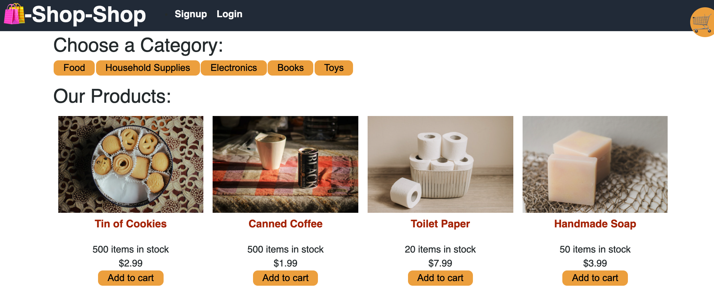

# Shop-shop

### Description :page_with_curl:

This code features refactored e-commerce platform from the module project to use Redux. 

GIVEN an e-commerce platform that uses Redux to manage global state
WHEN I review the app’s store
THEN I find that the app uses a Redux store instead of the Context API
WHEN I review the way the React front end accesses the store
THEN I find that the app uses a Redux provider
WHEN I review the way the app determines changes to its global state
THEN I find that the app passes reducers to a Redux store instead of using the Context API
WHEN I review the way the app extracts state data from the store
THEN I find that the app uses Redux instead of the Context API
WHEN I review the way the app dispatches actions
THEN I find that the app uses Redux instead of the Context API

The project is deployed to [Heroku.](https://shopandshop.herokuapp.com/)

#### Screenshots :camera_flash:

#### Technology Used :label: 

* MERN

#### Resources Used :wrench: 

 * [useReducer-Hook](https://reactjs.org/docs/hooks-reference.html#usereducer)
 * [Stripe.js](https://stripe.com/docs/stripe-js)
 * [Stripe-payments](https://stripe.com/)
 * [context](https://reactjs.org/docs/context.html)
 * [useEffect](https://reactjs.org/docs/hooks-effect.html#tip-optimizing-performance-by-skipping-effects)
 * [localForage](https://github.com/localForage/localForage)
 * [Making-Progressive-Web-App](https://create-react-app.dev/docs/making-a-progressive-web-app/)
 * [React Docs on useReducer](https://reactjs.org/docs/hooks-reference.html#usereducer)
 * [Accept-payments](https://stripe.com/docs/payments/accept-a-payment)
 * [redux](https://redux.js.org/introduction/getting-started)
 * [redux-fundamentals](https://redux.js.org/tutorials/fundamentals/part-1-overview)

#### Installation :electric_plug:

* shop-shop:
`npm install`
`npm run seed`
`npm start`
`heroku create`
`heroku run npm run seed`
`npm install react-redux`

* client
 to rest `npm run test`
 `npm install @stripe/stripe-js`

* server
`npm install stripe`

#### Contribution :heavy_plus_sign: 

Contributions, issues and feature requests are welcome. 
Check out [issues page](https://github.com/MarynaPR/shop-shop/issues). 
Give :star: if you found this project useful. 

#### Questions :question: 
Feel free to contact me with any questions via email: [:e-mail:](pryadkamaryna@gmail.com).
If you'd like to see my other projects, please visit my :octocat: 
[GitHub.](https://github.com/MarynaPR?tab=repositories)
